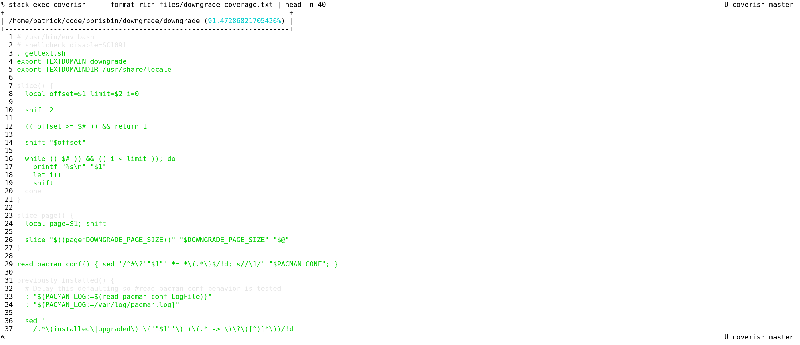

# coverish

Test coverage for shell scripts.



## Installation

1. Install [`stack`](https://docs.haskellstack.org/en/stable/README/)
1. Ensure `~/.local/bin` is on `$PATH`
1. Run

   ```console
   git clone https://github.com/pbrisbin/coverish
   cd coverish
   stack install
   ```

## Usage

```console
% coverish --help
Usage: coverish [-f|--format FORMAT] [-e|--exclude PATTERN]
                [-i|--include PATTERN] [-o|--output PATH] [PATH]

Available options:
  -f,--format FORMAT       Output in the given FORMAT
  -e,--exclude PATTERN     Exclude paths matching glob PATTERN
  -i,--include PATTERN     Re-include excluded paths matching glob PATTERN
  -o,--output PATH         Output to PATH (defaults to stdout)
  PATH                     Read from PATH (defaults to stdin)
  -h,--help                Show this help text
```

## Examples

### Bash

1. Add something like the following as early as possible in your script:

   ```bash
   if [ -n "$COVERAGE" ]; then
     exec 9>>"$COVERAGE"
     export BASH_XTRACEFD=9
     export PS4='_coverage:$BASH_SOURCE:$LINENO:'
     set -x
   fi
   ```

1. Run your tests

   Are you not testing your shell scripts? I recommend [cram](https://bitheap.org/cram/).

   ```console
   COVERAGE=/tmp/coverage.txt cram ./test
   ```

1. Run `coverish` on the output

   ```console
   coverish --format rich /tmp/coverage.txt | less -R
   ```

### Dash

*TODO*

### Zsh

*TODO*

### POSIX sh

Probably impossible.

## Development & Testing

```console
stack build --pedantic
```

```console
stack test
```

---

[CHANGELOG](./CHANGELOG.md) | [LICENSE](./LICENSE)
